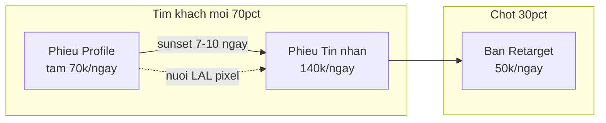

# Chiến lược 3 chiến dịch Meta Ads

Ground truth cho mục đích, KPI theo vai trò, và quy tắc sunset. Machine-readable: [`config/campaign_strategy.yaml`](../config/campaign_strategy.yaml).

## Bối cảnh chung

| | |
|---|---|
| **Shop** | Quisirella — trang sức used authentic |
| **Ngân sách** | 8.000.000 VND/tháng (~267.000 VND/ngày) |
| **Kênh chốt** | Instagram DM |
| **Mục tiêu kinh doanh** | Mess **chất lượng** (hỏi size/ship/cọc) — không phải volume mess |
| **Targeting giới tính** | Nữ ưu tiên + **nam** (không loại nam) — theo [`store_profile.yaml`](../config/store_profile.yaml) |

> Creative có thể nghiêng nữ, nhưng **targeting phủ cả hai giới**. Agent không đề xuất "chỉ target nữ" hoặc loại bỏ nam.

## Phễu ngân sách

| Giai đoạn | Tìm khách mới | Chốt khách cũ |
|---|---:|---:|
| **Hiện tại** (3 campaign) | **70%** (Phễu Tin nhắn + Profile) | **30%** (Retarget) |
| **Sau 7–10 ngày** (tắt Profile) | **80%** (Phễu Tin nhắn) | **20%** (Retarget) |

---

## Tóm tắt cho AI Agent

| Campaign | Vai trò một câu |
|---|---|
| **Phễu Tin nhắn** | Máy kiếm tiền chính — nuôi lớn |
| **Phễu Profile** | Mồi tạm — sẽ tắt sau 7–10 ngày |
| **Bán Retarget** | Máy chốt — giữ nhỏ nhưng đều |

**Quy tắc vàng:** Đánh giá mỗi campaign theo **funnel_role** — không dùng chi phí/tin nhắn để penalize Profile Visit.

---

## Chiến dịch 1 — Phễu Tin nhắn

| | |
|---|---|
| **Tên Ads Manager** | `Phễu_TinNhan_LAL1%` |
| **Mục tiêu Meta** | Lượt bắt đầu cuộc trò chuyện qua tin nhắn |
| **Vai trò phễu** | Top + Middle — vừa tìm người mới vừa lọc ý định mua |
| **Thời gian sống** | Lâu dài — scale lên 210k/ngày sau khi tắt Profile |

**Ý nghĩa kinh doanh:** Chiến dịch **kiếm khách mới chính**. Máy học tìm đúng người có hành vi inbox shop để mua. Thay thế chiến dịch Profile Visit cũ (mess rẻ nhưng không chốt).

| Hạng mục | Chi tiết |
|---|---|
| **Đối tượng** | Lookalike 1% từ tệp khách đã mua + người đã inbox 180 ngày |
| **Loại trừ** | Người đã mua 30 ngày |
| **Targeting** | 22–45 tuổi, nữ ưu tiên + nam (không loại nam), HCM + HN |
| **Ngân sách** | 140.000 VND/ngày (4,2 triệu/tháng — **52,5%**) |
| **Creative** | 2 video "Nỗi sợ" (hàng fake, mất tiền) |

**KPI thành công:**

| Loại | Chỉ số | Ngưỡng |
|---|---|---|
| **Chính** | Chi phí/tin nhắn | **< 25.000 VND** (sau 7 ngày học) |
| **Phụ** | Mess hỏi chi tiết (size, ship, cọc) | **> 40%** — *tracking manual* |
| **Learning** | Mess/tuần | **≥ 50** để thoát máy học |

---

## Chiến dịch 2 — Phễu Profile Visit

| | |
|---|---|
| **Tên Ads Manager** | `Phễu_Profile_1806` |
| **Mục tiêu Meta** | Lượt truy cập trang cá nhân Instagram |
| **Vai trò phễu** | Top only — tạo nhận biết + mồi pixel |
| **Thời gian sống** | **Tạm thời** 7–10 ngày |

**Ý nghĩa kinh doanh:** Chiến dịch **mồi pixel tạm thời**, không phải để bán. Tạo traffic rẻ để nuôi dữ liệu Lookalike và giữ độ phủ thương hiệu. Phễu Tin nhắn mới tạo — cần dữ liệu hỗ trợ trong giai đoạn học máy.

| Hạng mục | Chi tiết |
|---|---|
| **Đối tượng** | Giống hệt Phễu Tin nhắn (LAL 1%, 22–45, cả nữ + nam) |
| **Ngân sách** | 70.000 VND/ngày (2,1 triệu/tháng — **26%**) |
| **Baseline kỳ trước** | 2.480 visit, 2,6 triệu VND, CTR 8,47% |

**KPI thành công:**

| Loại | Chỉ số | Ngưỡng |
|---|---|---|
| **Chính** | Chi phí/visit | **< 1.200 VND** |
| **Loại trừ** | Chi phí/tin nhắn, mess chất lượng | **Không kỳ vọng** |

**Quy tắc sunset (tắt Profile):**

Tắt khi **Phễu Tin nhắn** đạt **cả 3** điều kiện liên tiếp **3 ngày**:

1. Chi phí/tin nhắn **< 25.000 VND**
2. **≥ 5 mess chất lượng/ngày** (*manual*)
3. Liên tiếp 3 ngày

→ **Hành động:** Pause Profile, chuyển 70k/ngày sang Phễu Tin nhắn.

---

## Chiến dịch 3 — Bán Retargeting

| | |
|---|---|
| **Tên Ads Manager** | `Ban_Retarget_30D` |
| **Mục tiêu Meta** | Tin nhắn (hoặc Lượt xem — tùy cài đặt) |
| **Vai trò phễu** | Bottom — chốt đơn |
| **Thời gian sống** | Lâu dài, ngân sách thấp |

**Ý nghĩa kinh doanh:** Chiến dịch **chốt đơn** cho khách ấm đã tương tác. Không tìm khách mới — chỉ nhắc lại người đã biết Quisirella. Hàng 10–20tr cần nhiều chạm — không tắt hẳn.

| Hạng mục | Chi tiết |
|---|---|
| **Đối tượng** | 1.900–2.200 người: vào IG 30 ngày, xem video 75%, đã inbox chưa mua (cả nữ + nam — không lọc giới) |
| **Loại trừ** | Người đã mua |
| **Ngân sách** | 50.000 VND/ngày (1,5 triệu/tháng — **19%**) |
| **Giảm budget** | Xuống 30k/ngày nếu tần suất > 3,5/tuần |
| **Creative** | Carousel 5 sản phẩm best-seller (Micro Link 17tr5 + 4 món khác) |

**KPI thành công:**

| Loại | Chỉ số | Ngưỡng |
|---|---|---|
| **Chính** | CPM | **~80.000 VND** (chấp nhận cao vì tệp nhỏ) |
| **Phụ** | CTR | **> 3%** |
| **Phụ** | Tần suất | **< 3,5/tuần** |
| **Chất lượng** | Mess hỏi cọc | **> 20%** — *tracking manual* |

---

## KPI manual (không có trên Meta API)

Hệ đo lường **2 lớp** — chi tiết: [`08-dm-quality-log.md`](08-dm-quality-log.md) + `config/campaign_strategy.yaml` → `measurement`.

### Lớp 1 — Proxy tự động (Meta API)

| Metric | Công thức | Ý nghĩa |
|---|---|---|
| `engaged_rate` | depth_3 / messaging_started | Khách nhắn ≥ 3 lượt — proxy hội thoại tư vấn |

### Lớp 2 — Sổ ghi tay (manual)

| Metric | Campaign | Định nghĩa | Ghi vào |
|---|---|---|---|
| `quality_mess_rate` | Phễu Tin nhắn | % mess hỏi size/ship/cọc (không chỉ giá) | `08-dm-quality-log.md` |
| `quality_mess_per_day` | Phễu Tin nhắn | Số mess chất/ngày (sunset Profile) | `08-dm-quality-log.md` |
| `price_only_mess` | Phễu Tin nhắn | Số mess **hỏi giá rồi im** — theo dõi tỷ lệ khách chỉ quan tâm giá | `08-dm-quality-log.md` |
| `profile_visit` | Phễu Profile | Lượt truy cập trang IG (cột Ads Manager) | `08-dm-quality-log.md` |
| `orders_closed` | Account | Đơn chốt từ Business FB "đã chuyển đổi" | `08-dm-quality-log.md` |
| `coc_inquiry_rate` | Bán Retarget | % mess hỏi cọc | `08-dm-quality-log.md` |

**Mục tiêu:** Tối đa mess chất lượng — **không** chạy theo volume. Chốt đơn phụ thuộc khách.

Agent: đọc `08` trước khi đánh giá sunset/quality; dùng depth_3 proxy khi mess tay N/A.

---

## Legacy aliases (báo cáo cũ)

Báo cáo API cũ (`01`, `06`) có thể dùng tên campaign khác. Map sang strategy hiện tại:

| Tên cũ (trong output/) | Campaign ID mới |
|---|---|
| phễu - target tin nhắn | `phieu_tinnhan_lal1` |
| Lượt tương tác mới - 1806 | `phieu_profile_1806` |
| Bán - Bản sao | `ban_retarget_30d` |

---

## Liên kết

- KPI hierarchy: [`00-ads-kpi-guide.md`](00-ads-kpi-guide.md)
- Sổ DM chất lượng + đơn: [`08-dm-quality-log.md`](08-dm-quality-log.md)
- Deep-dive số liệu ACTIVE: [`06-active-campaigns-analysis.md`](06-active-campaigns-analysis.md) *(regenerate khi fetch mới)*
- Session log (KPI manual): [`07-session-log.md`](07-session-log.md)
